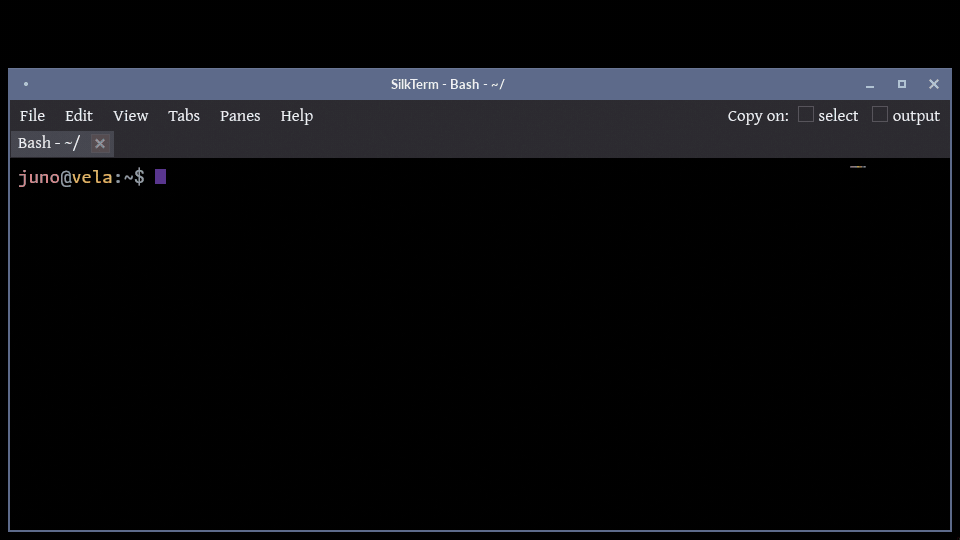

<!-- markdownlint-disable MD007 -- Unordered list indentation -->
<!-- markdownlint-disable MD010 -- No hard tabs -->
<!-- markdownlint-disable MD033 -- No inline html -->
<!-- markdownlint-disable MD055 -- Table pipe style [Expected: leading_and_trailing; Actual: leading_only; Missing trailing pipe] -->
<!-- markdownlint-disable MD041 -- First line in a file should be a top-level heading -->

<!--

-->

<!-- TOC ignore:true -->
# SilkTerm

<!-- Full demo video with sound: [SilkTerm on YouTube](https://www.youtube.com/watch?v=TODO) -->

SilkTerm™ is a hardware-accelerated terminal for Linux, Windows and macOS that scrolls new output smoothly, a pixel at a time, instead of jumping whole lines. Fast output isn't held back; the scroll speeds up to keep pace. It also has an animated cursor, a text halo that keeps text readable over a wallpaper or a see-through window, a scrollback minimap, tabs and split panes. One executable, written in Rust.

<!--
<table style="border: none; border-collapse: collapse;">
	<tr style="border: none; border-collapse: collapse;">
		<td style="border: none; border-collapse: collapse;"></td>
		<td style="border: none;">SilkTerm is the only known terminal currently in existence, that smooth-scrolls lines on output - for silky-smooth and less-tiring long terminal sessions. It also has smooth cursor options such as phase effect for blinking, and smooth movement.  SilkTerm also has multiple tabs, split-panes, transparency and blur, background image and blur, text scrim, and can run without a menu and/or window decorations.  Cross-platform. Written in Rust for a small single executable, and blazing speed.</td>
	</tr style="border: none; border-collapse: collapse;">
</table>
-->

<!-- TOC ignore:true -->
## Table of contents

<!-- TOC -->

- [Why?](#why)
	- [Why smooth-scrolling output](#why-smooth-scrolling-output)
	- [Why text scrim](#why-text-scrim)
- [Features](#features)
- [Wallpaper pack](#wallpaper-pack)
- [Terminal showdown - speed and size](#terminal-showdown---speed-and-size)
- [Getting and using](#getting-and-using)
	- [Installation](#installation)
		- [Packages and installers](#packages-and-installers)
		- [Direct stable and dev install scripts](#direct-stable-and-dev-install-scripts)
		- [Build it yourself](#build-it-yourself)
	- [Set up development environment](#set-up-development-environment)
	- [Configuration](#configuration)
	- [Shell integration](#shell-integration)
	- [Opening scripts and folders on Windows](#opening-scripts-and-folders-on-windows)
- [Contributing](#contributing)
- [Support SilkTerm](#support-silkterm)
	- [Direct support](#direct-support)
	- [Indirect support](#indirect-support)
	- [Get the word out](#get-the-word-out)
- [Legal stuff](#legal-stuff)

<!-- /TOC -->

## Why?

### Why smooth-scrolling output

All other terminal emulators in existence at the time this was written, currently snap scrolling output to fixed lines. Nothing can appear in-between those lines (except when mouse-scrolling on some terminals).

For output that can be sporadic - e.g. something scrolling slowly one line at a time sometimes, then jumping several lines at once other times (e.g. while watching a live log file with `tail -f`) - [the eye/brain combo can struggle to track the output](https://www.youtube.com/watch?v=yQaC-ZzTf78), and you get "lost" trying to follow it.

One analogy is playing a video game with mouse-look at, say, 3 frames-per-second visual output. It is nearly impossible to keep your bearings when the world view jumps wildly from frame-to-frame. But at say 240 FPS on a matching Hz monitor, it looks buttery smooth and immersive, and the subtle task of mentally maintaining where you are becomes trivial.

As the YouTube video linked above goes into, jerky line-snapped output taxes mental resources - however slightly - in a way that stacks up over long sessions. At the extreme, it can contribute to headaches and fatigue. And that's brainpower that could have been used to solve whatever it is you're working on.

The crazy thing is that several early CRT text-mode computers offered smooth-scrolling. (For example, many UNIX client terminal consoles of the 1980s.)

The smooth-scrolling output concept was completely abandoned in the 80s and 90s, because:

- Rate-limited output scrolling would cap fast output, and possibly overflow the scrollback buffers resulting in lost output.

	- SilkTerm solves this problem by automatically ramping up the scroll speed, smoothly, as needed to keep up with output speed.

- Smooth scroll solved the same "tracking-a-moving-line" problem that scrollback buffers + pagers (such as `more`, `less`) later solved better, with the technology available at the time.

Video examples of early smooth-scroll displays:

- [DEC VT100 - VT420](https://www.youtube.com/watch?v=tSJfzrSA0ec)

- [Wyse WY*nn*](https://www.youtube.com/watch?v=8q6YPAzH02s)

SilkTerm's smooth-scrolling output is a joy to work with. You really have to try it to "get" it. And the faster your monitor display Hz, the more gorgeous it feels.

### Why text scrim

A text *scrim* is a subtle halo drawn behind each glyph - usually of the opposite luminosity to the text - purely as a readability aid. It's the same technique graphic designers use, sometimes called as "outer glow". (And is different from angled "drop-shadow", which is a creative effect.)

SilkTerm calls it a "scrim" because that's its whole job: keeping text legible, not decoration. (Though this isn't a hard-and-fast graphic design "rule" - there's lots of overlap in both directions.)

If you've ever used a terminal that supports background transparency, and/or background images (both of which SilkTerm offers), that novelty can quickly wear off. You'll notice that the text might be too hard to read, particularly in a long computing session.

Text can be particularly hard to read, for example when using light text on a normally dark background, and:

- The background is very transparent, and the terminal is on top of bright and/or visually "busy" content below. And/or,

- The background image is bright.

(*Or vice-versa for dark text on a normally light background, with dark elements under the text.*)

## Features

- **Smooth pixel-at-a-time scrolling on terminal output**.

	- *You have to see how gorgeous it looks on a high-refresh rate monitor. No animated gif reproduction can do it justice*.

	- It even works inside `less`, `vim` and other full-screen TUIs.

- Smooth mouse wheel scrolling. Several other terminals offer this feature.

- **Smooth cursor movement**. This is the cherry on top of "smooth".

- **Text scrim (readability backing)**. As mentioned in the section above, this optional feature helps keep text readable even when the text is on top of similar-colored backgrounds and/or when using high background transparency. It's the only known terminal to offer it, though there are several terminals that offer angled *drop-shadow*. (A scrim is conceptually similar - but improves, rather than reduces, readability.)

	- A contrast floor and a text outline are separate settings that do the same job in other ways.

- **Scroll buffer Minimap**. A column beside the text shows the whole scrollback in miniature. Click or drag it to jump. Switch it off to get more space back.

- **Cursor size and animation options**. Phased blinking, or smoothly pulsing in size. (Or just regular.) Adjustable rate.

- **Background transparency**. The background (with adjustable %) becomes see-through, but not the text.

- **Background transparency blur**. If using background transparency and this is enabled, everything behind the terminal is blurred. Currently supported on X11 with KWin or picom. (But limited to the compositor's options. SilkTerm just talks to the WM to enable it.)

- **User-selectable background image**. One is built in. A pack of >100 more carefully created or curated wallpapers is a separate download, or point it at a folder of your own. All with open licenses.

	- The background image can be dimmed with adjustable %, relative to the background color - and independent of main background transparency.

	- `silkterm --wallpaper PATH` switches the running window's wallpaper from inside a pane.

- **Automatic text colors based on the wallpaper**. The text and cursor take a hue that suits the picture based on color theory, and stays readable on it.

- **Background image blur**. With an optional Gaussian blur radius (without altering the source image), also independent of transparency blur.

- **Background image contrast mask**. Flattens the image's local contrast so it stops competing with the text on top of it, again without altering the source image. The flatten scale and strength are adjustable, and can be blended with values derived from the image itself.

- **Background image fit**. Stretch to fill the window, or zoom to cover it while keeping the aspect ratio.

	- An image can also carry its own fit in its XMP metadata (`wallpaper:Fit`, plus a `wallpaper:Anchor` that picks which part of it a zoom crop keeps), overriding the default per image - so a photo isn't squashed while a gradient still fills the window. Read straight from the image file, and switchable off.

	- Two more tags, `wallpaper:Opacity` and `wallpaper:Blur`, let an image carry its own visibility and blur, so a busy picture can sit quieter than the rest of a folder. Your sliders then apply to images without the tags. Also switchable off.

- **Split panes**: A native feature to arbitrarily split any pane in either direction. Panes can be freely drag-n-dropped to change locations. Panes split in successive directions are automatically evenly distributed, unless adjusted (with the mouse).

- **Tabs that name themselves** from the shell, program and/or folder.

	- Accepts custom tab names from the user (double-click to rename), and/or from some programs that like to rename the tab they're in.

- **Automatically finds your system's shells**. bash, zsh, fish, PowerShell, cmd, Nushell, WSL distributions and more show up under New tab with shell.

- **Window decorations and/or the menu can be disabled**, for "nothing but terminal". Fullscreen can also be toggled.

- **Window size and font zoom are remembered per monitor**, by its resolution and DPI. A window moved to another monitor takes that monitor's size once it stops moving. On Wayland a window only learns which monitor it is on once it is showing, so there it may resize just after it opens.

- **Robust Unicode and emoji support**. With internal Unicode fallback rendering for the glyphs that the chosen display font can't display.

- **Text brightens on "bell"**. (An idea borrowed from Windows Terminal, and surely others.)

- **True-color, 256-color, and 16-color text support**, as well as standard bold & italic.

- **Read-only output toggle**. Typing and paste stop reaching the program. Select and copy still work.

- **Clickable links**. Hover a URL to underline it, Ctrl+click to open it (Command+click on macOS), or use the right-click menu. Only known-safe schemes are ever treated as links, and an app that has taken over the mouse keeps it.

- **Smart double-click text selection**. Recognizes paths, URL, git remotes, quoted text, bracketed text, etc.

- **Copy on select, and/or copy on output**. Both optional, both per-pane. Copy-on-output grabs what a command printed without the prompt around it. A program in the pane you're using can set the clipboard too, the way tmux and editors over ssh do.

- **Themes**. Comes with four color themes - each with a dark and a light variant. Or create and save your own.

- **Performance profiles**. SilkTerm measures performance on the first run, and picks a performance profile. If the display can't keep up, it steps down on its own.

- **Remote access profile**. When SilkTerm is used over a low-speed RDP or VNC (etc.) graphical connection, SilkTerm applies a temporary lower-animation profile.

- **Simple and sane configuration**. No pages of nested tabs representing multiple settings metaphors. But if you need to get fancy with multiple sets of wildly different options - that's easy with alternate config files, and/or scripted launch-time arguments.

- **Rich command-line syntax**. A simple yet (optionally) powerful CLI syntax, that allows creating multiple tabs and/or complex pane structure(s) at launch time.

- **Arbitrary alternate config files**, another way to launch SilkTerm with wildly different options, without overwriting the main config file.

- **Written in Rust as a single self-contained binary**. No runtime dependencies. Fast. The one binary bundles the entire GPU and text-rendering stack, which is why it's about 11 MiB; [the FAQ explains how that *actually* compares to a GTK terminal's few-hundred-KiB launcher](FAQ.md).

- **One codebase for Linux + Windows + macOS, all with x86_64 and ARM builds**. The Windows and ARM versions all build in one pass on x86_64 Linux. *macOS builds from the same codebase on a Mac, as one app for both Intel and Apple silicon*.

- **Native X11 and Wayland on Linux** from one binary. The display backend is chosen at runtime, with no separate build or wrapper.

- **GPU-accelerated with software fallback**. An idle window can also give its GPU memory back.

- **Releases memory, CPU, and GPU resources when idle**. Without affecting running programs. The timeouts are tunable. The only way you even knew something happened, is the wallpaper reloads in about a quarter second, and "... (resources restored)" appears for a few seconds in the window title.

- Loosely based on [Alacritty](https://github.com/alacritty/alacritty), for the basement plumbing - to avoid rewriting the complex but solved problems of terminal emulation. (Alacritty is also a high-performance, open-source terminal written in Rust.)

	- *SilkTerm's codebase is about five times the size of the Alacritty terminal core it sits on. That core solves a thoroughly and repeatedly solved problem; there was no reason to write another one.*

SilkTerm for Linux and Windows is free from the releases page, and one person builds it. If it earns a place on your screen, [sponsoring](https://github.com/sponsors/jim-collier) keeps it going.

## Wallpaper pack

The 102 wallpapers SilkTerm was built and tuned against are in [`filesystem/home/.config/silkterm/wallpaper/`](filesystem/home/.config/silkterm/wallpaper/). Put them next to your config and rotation picks one each launch, favoring whatever it hasn't shown lately. Next wallpaper, on the View menu and the right-click menu, moves on without waiting. Each image carries its own fit and anchor in its metadata, so a photo is cropped rather than squashed - while a gradient stretches edge to edge. Provenance for every one of them is in [wallpaper-attribution.md](filesystem/home/.config/silkterm/wallpaper-attribution.md).

Click the sheet for the [browsable gallery](https://yottacore.github.io/silkterm/wallpapers/) - any wallpaper opens full size in place, the arrow keys page through them, and each one carries its credit and license underneath.

They come to 58 MiB against an 11 MiB terminal, so no package or installer includes them - fetch the folder on its own. Bash (Linux, macOS, WSL):

~~~bash
dir="${XDG_CONFIG_HOME:-$HOME/.config}/silkterm" && mkdir -p "$dir" && curl -fsSL https://github.com/yottacore/silkterm/archive/refs/heads/main.tar.gz | tar -xz -C "$dir" --strip-components=5 silkterm-main/filesystem/home/.config/silkterm/wallpaper
~~~

PowerShell (Windows):

~~~powershell
$dest = "$env:LOCALAPPDATA\silkterm"; $tgz = "$env:TEMP\silkterm-main.tar.gz"; New-Item -ItemType Directory -Force $dest | Out-Null; curl.exe -fsSL https://github.com/yottacore/silkterm/archive/refs/heads/main.tar.gz -o $tgz; tar -xzf $tgz -C $dest --strip-components=5 silkterm-main/filesystem/home/.config/silkterm/wallpaper; Remove-Item $tgz
~~~

Either one is a single line, so it survives a paste however your terminal handles one, and puts the images where rotation looks for them - `wallpaper/` beside the config on Linux and macOS, and under `%LOCALAPPDATA%` on Windows (see the table in [Configuration](#configuration)). Both pull the whole repository archive, since GitHub serves no smaller unit - about 67 MiB over the wire.

## Terminal showdown - speed and size

Smooth scrolling isn't useful if the terminal falls behind the moment something dumps a lot of text, so throughput is measured and reported below.

In testing, each terminal is fed byte-identical, deterministic streams of one UTF-8 width class at a time - plain ASCII, then 2-byte, 3-byte and 4-byte characters, then a mix - and timed to a device-attributes reply, so the clock stops when the terminal has consumed the stream rather than when the pipe accepted it. Speed is measured at a 160x42 grid.

A terminal is also the program that is always open, usually several times over, so what it costs while doing nothing matters. Size and memory are measured separately, with each terminal at a 100x30 grid and its own defaults.

Sorted by speed. Terminals not yet measured for speed follow, ordered by what it takes to install them.

<!-- termbench:begin -->

| OS9 | Terminal                                             | Ver         | 1-byte1 | 4-byte1 | Speed score2 | File size3 (MiB) | File+ deps4 (MiB) | Mem4 (MiB)
| :------------- | :--------------------------------------------------- | :---------- | -----------------: | -----------------: | ----------------------: | --------------------------: | ---------------------------: | --------------------:
| \[multi\]      | $\textcolor{limegreen}{SilkTerm}$ plain6  | 1.0.0-beta2 |               86.9 |              129.3 |                **71.1** |                        10.5 |                         14.1 |                 100.1
| \[multi\]      | Alacritty8                                | 0.15.1      |               79.8 |              129.1 |                **68.4** |                         8.5 |                         12.7 |                  50.4
| \[multi\]      | $\textcolor{limegreen}{SilkTerm}$ +candy5 | 1.0.0-beta2 |               77.4 |              135.1 |                **67.6** |                        10.5 |                         14.1 |                 167.7
| Linux          | GNOME Terminal                                       | 3.58.1      |              100.2 |               62.6 |                **55.3** |                         0.4 |                         84.0 |                  53.6
| Linux          | XFCE4 Terminal                                       | 1.2.0       |               94.2 |               65.0 |                **54.0** |                         0.3 |                         84.1 |                  48.6
| Linux          | Terminator                                           | 3.13.5      |               87.8 |               67.3 |                **51.8** |                      script |                         92.6 |                  82.2
| Linux          | XTerm                                                | 407         |               28.3 |               48.5 |                **23.9** |                         0.9 |                          6.0 |                   9.4
| \[multi\]      | kitty                                                | 0.48.1      |               24.2 |               59.6 |                **22.6** |                         0.2 |                        115.0 |                 140.8
| \[multi\]      | WezTerm                                              | 20240203    |               15.6 |               22.2 |                **10.4** |                        70.5 |                        129.9 |                  84.8
| \[multi\]      | Tabby                                                | 1.0.235     |                8.5 |                9.0 |                 **5.7** |                       192.1 |                        454.2 |                 473.4
| Win            | conhost.exe                                          | -           |                  - |                  - |                       - |                         1.0 |                          1.0 |                  21.1
| Win            | PuTTY                                                | -           |                  - |                  - |                       - |             1.67 |                            - |                     -
| Linux          | Guake                                                | -           |                  - |                  - |                       - |             1.77 |                            - |                     -
| Linux          | Konsole                                              | -           |                  - |                  - |                       - |             7.37 |                            - |                     -
| \[multi\]      | Windows Terminal                                     | -           |                  - |                  - |                       - |            11.17 |                         14.2 |                  93.0
| \[multi\]      | Ghostty                                              | -           |                  - |                  - |                       - |            32.07 |                            - |                     -
| macOS          | iTerm2                                               | -           |                  - |                  - |                       - |            43.07 |                            - |                     -
| Win            | MobaXterm                                            | -           |                  - |                  - |                       - |            43.47 |                            - |                     -
| \[multi\]      | Hyper                                                | -           |                  - |                  - |                       - |                       147.8 |                        300.9 |                 309.4
| macOS          | Terminal.app                                         | -           |                  - |                  - |                       - |                           - |                            - |                     -
| macOS          | Warp                                                 | -           |                  - |                  - |                       - |                           - |                            - |                     -

<!-- termbench:end -->

1 Throughput in MB/s, higher is better, on a stream made entirely of characters of that UTF-8 width - 1-byte is plain ASCII, 4-byte is emoji. Two more width classes and a mixed stream are measured as well and count toward the score; the tool prints all five. Only rows measured at the same grid size are comparable.

2 Millions of cells per second - the weighted geometric mean of all five classes, leaning toward plain ASCII since that is most of what a terminal ever sees, and geometric so no single class can dominate. Counted in cells rather than bytes, because a wide-character stream moves far more bytes for the same amount of screen. It says how fast a terminal swallows output and keeps up, not how fast it rasterizes glyphs - only a screenful is ever visible, so most of a large stream is parsed, stored and scrolled past. The clock stops when the terminal answers a query that it can only answer once it has worked through everything queued, so a terminal that never answers cannot be timed this way and its speed cells stay blank. A slow terminal gets fewer repetitions of the same payloads, which makes its figures noisier but no less comparable.

3 This number is near-meaningless alone. A small executable usually means the code sits in shared libraries instead. But they are loaded only once however many programs map them - so anything built on a stack the desktop already loads costs less than its File+deps implies. SilkTerm links nothing beyond the C runtime and what the graphics stack loads at runtime (for maximum portability and long-term stability without "bitrot"), so almost all of it is in the one file.

4 File+deps is the executable plus everything else it needs beyond a base OS. Memory is the unique resident footprint of the whole process tree - private pages, plus each shared mapping counted once. Self-contained bundles count their extracted payload plus the system libraries they still borrow. Both columns leave out the graphics stack and what it pulls in, because accelerated terminals share it with the compositor and every other accelerated program: 141 SilkTerm, 105 WezTerm, 73 kitty and Alacritty, 48 Tabby, 1 Hyper. "A base OS" is not the same size on every platform - on Linux it means the C runtime and nothing else, since a desktop library is something you installed, while on Windows the whole of System32 ships with the machine - so a Windows row counts less toward File+deps than a Linux one, on top of everything in note 9. Expect a few MiB of drift between runs, since libraries load on demand.

5 SilkTerm as it ships, with the eye candy on: wallpaper, text scrim and outline, animated cursor, smooth application scrolling and color emoji. Every one of them is a setting, and the row below is the same binary with the lot switched off.

6 Wallpaper, scrim, outline, cursor animation, smooth app scrolling, transparency and color emoji all off.

7 Vendor's released artifact, not measured here, so not comparable with the measured columns. Blank: conhost.exe and Terminal.app ship inside the OS, Warp publishes no size, and the macOS rows have nothing here to run on.

8 SilkTerm uses Alacritty's terminal-emulation core, so the two share the parsing and grid work that this benchmark mostly measures - which is why they are within a few percent of each other, and why both sit so far ahead of terminals that parse their own way. It is the lighter of the two to run, which is what the eye candy costs: SilkTerm with everything switched off is 50 MiB above it, and as it ships, 117.

9 Every speed figure comes from one machine, because the measuring rig is not neutral: a headless Wayland compositor driving a discrete GPU (Linux, Ryzen host, GeForce RTX 3060 Ti). XTerm draws only on X11, so its row comes from a private X server. Through the compositor's Xwayland it reads about a third slower, 18 MB/s of plain ASCII against 28. <b>There are no Windows rows, and there will not be.</b> On Windows a terminal never receives its output directly. The console host relays it over a pipe, and that pipe sets the pace, so a Windows figure measures the transport rather than the terminal. The size and memory columns are unaffected, which is why Windows rows appear there. They come from a private X server drawing in software, at a 100x30 grid, with the conhost.exe and Windows Terminal rows taken on a Windows machine. Drawn in software, a GPU terminal's window buffers sit in its own memory, so they count toward Mem. The measurements behind all of this are in [showdown-readme.md](utility/include/showdown-readme.md).

Run it yourself with [`utility/update-showdown.py`](utility/update-showdown.py) (`--quick` for a thirty-second version). It needs only Python 3 and a terminal, works on any emulator on any OS, and refreshes the speed columns above as more terminals are measured.

## Getting and using

### Installation

#### Packages and installers

The primary install is a native package from the [releases page](https://github.com/yottacore/silkterm/releases): `.deb` / `.rpm` on Linux, or the NSIS setup `.exe` on Windows. Optional either way: fetch the wallpaper pack, as the [Wallpaper pack](#wallpaper-pack) section shows.

On macOS, SilkTerm is a Mac app sold through an app store. A Microsoft Store version is on the way as well. Links go here once the listings are up. The packages on the releases page stay free.

#### Direct stable and dev install scripts

Prefer a plain binary? These one-liners work out your operating system and CPU on their own, download the release built for it, check its sha256, and install it. Once a release is signed, the checksums file has to carry a good signature from the release key or nothing is installed. Each prints what it is about to do and asks before touching anything, and does nothing at all when you are already up to date. The defaults suit most people - add `--help` for the handful of things you can change.

Bash, written for 3.2 or newer and tested on 5 (Linux, macOS, WSL):

~~~bash
bash <(curl -fsSL https://raw.githubusercontent.com/yottacore/silkterm/main/install.bash)
~~~

PowerShell 5.1 or 7+ (Windows, Linux, macOS):

~~~powershell
irm https://raw.githubusercontent.com/yottacore/silkterm/main/install.ps1 | iex
~~~

PowerShell needs the script-block form to pass anything, `-Help` included:

~~~powershell
& ([scriptblock]::Create((irm 'https://raw.githubusercontent.com/yottacore/silkterm/main/install.ps1'))) -Help
~~~

Install locations:

| OS      | User install (default)              | <- Launcher                                                   | (or) System install          | <- Launcher
| :------ | :---------------------------------- | :------------------------------------------------------------ | :--------------------------- | :---------------------------------------------------
| Linux   | `~/.local/bin/silkterm`             | `~/.local/share/applications/silkterm.desktop`                | `/usr/local/bin/silkterm`    | `/usr/local/share/applications/silkterm.desktop`
| Windows | `%LOCALAPPDATA%\Programs\SilkTerm\` | Start Menu shortcut, and the install dir is added to `%PATH%` | `C:\Program Files\SilkTerm\` | Common Start Menu shortcut (needs an elevated shell)

The releases page carries Linux and Windows binaries only, and the Mac app comes from its store listing. On anything else the installer says so and lists what the release does carry, so build it yourself - below.

#### Build it yourself

Install the per-platform prerequisites first ([prerequisites.md](prerequisites.md)), then on Linux:

~~~bash
cargo run --release
~~~

That's the whole of it for a native build. [build.md](build.md) covers the cross-builds (Windows, and ARM64 for both) which all run from an x86_64 Linux box.

Release builds are reproducible on the same system and toolchain. A commit built in two different folders gives byte-identical binaries for all four published targets, since neither the folder nor the time of the build goes into them. [`cicd/utility/repro-check.bash`](cicd/utility/repro-check.bash) checks that the way the pipeline builds a release. A build on another distribution or with another linker can still differ.

### Set up development environment

[prerequisites.md](prerequisites.md) lists what each platform needs, down to the package names and the one-time toolchain setup. [build.md](build.md) covers the build and cross-build commands, and [contributing.md](contributing.md) covers the branch and review flow.

The toolchain version is pinned in `rust-toolchain.toml`, so rustup picks the right one on its own.

To run everything a change has to pass before it can be pushed - format, lint, regression tests, profiling, the release and cross builds, packaging, then backup and publish:

~~~bash
cicd/cicd.bash [--quick]
~~~

`--quick` skips the cross-builds and the slow stages. A fast subset of it - format check, lint, tests - also runs as a pre-push hook on any push to main (`cicd/cicd.bash --gate`). Turn the hooks on once per clone:

~~~bash
git config core.hooksPath utility/git-hooks
~~~

### Configuration

On first run SilkTerm writes a commented config file with all defaults, in the place each platform keeps settings:

| OS      | Config                                            | Wallpaper folder
| :------ | :------------------------------------------------ | :-----------------------------------
| Linux   | `$XDG_CONFIG_HOME/silkterm/` (or `~/.config/...`) | beside the config
| Windows | `%APPDATA%\silkterm\`                             | `%LOCALAPPDATA%\silkterm\wallpaper\`
| macOS   | `~/Library/Application Support/silkterm/`         | beside the config

Setting `XDG_CONFIG_HOME` overrides the platform default everywhere, and `--config PATH` overrides everything - an alternate config keeps its own wallpaper and history beside itself rather than sharing the defaults.

Windows splits the two because settings are worth roaming between machines and a 60 MiB wallpaper pack is not. A pack already sitting beside the config still works; nothing has to be moved.

If making changes directly (rather than through Settings), you can apply them immediately with the "Reload config" menu item. Settings reads the file each time it opens, so it also shows what another SilkTerm window saved.

Settings names are meant to read plainly, but a few of them - scrim, contrast mask, automask mix - are particular to SilkTerm. [glossary.md](glossary.md) defines those.

To start over from the shipped defaults, run `silkterm --reset-config`. The old file is kept alongside as `config.shcl.bak` rather than deleted.

When an update converts the file to a newer format, the file as it was is kept alongside, named for the local time it was converted and the format it had, such as `config_backup_20261003-142233_format-v2.shcl`. Every older version is kept, and a file named with `--config` keeps its own name in front. A line the new format can't hold stays in the file as written, and SilkTerm puts up a notice saying how many there were and where the old file is. If the file can't be converted where it is, because it isn't UTF-8 text or the new format can't read it, SilkTerm writes a new one from the defaults with every setting it can still read, and the notice says how many it couldn't carry over.

Drop a few images into a `wallpaper` folder next to the config and SilkTerm picks one each launch, favoring whatever it hasn't shown lately. Naming a wallpaper in the config, or passing one on the command line, takes precedence. The [wallpaper pack](#wallpaper-pack) is a ready-made folder to start from.

### Shell integration

A new tab, split or window starts in the directory the current pane is in. For most shells that needs nothing set up - SilkTerm reads the shell process's own directory.

PowerShell is the exception: `Set-Location` moves PowerShell's own idea of where it is and leaves the process where it was launched, so there is nothing to read and a new pane would start in the launch directory.

SilkTerm handles that one for you. A few seconds after launch it adds a small directory-reporting block to each PowerShell profile - and it will not touch a profile that already reports (a Windows Terminal setup, oh-my-posh, anything else), will not rewrite what is there (it appends, after saving a copy beside it), will not change your prompt, and will not put the block back if you delete it. A shell whose execution policy would refuse to load the profile is left alone and said so, rather than being handed a file it cannot read. Clear "Update PowerShell profiles" on the Shell tab of Settings, or set `shell.integration: false`, to switch it off before it ever runs.

Same story for a shell running behind `ssh` or in a container - that one is yours to set up, since the shell you are typing at is not the process SilkTerm started.

[shell-integration.md](shell-integration.md) covers all of it, including the snippets for bash, zsh and fish.

### Opening scripts and folders on Windows

The Shell tab of Settings has an "Open with SilkTerm" group, one row per kind of file:

- Batch files: `.bat` and `.cmd`.

- PowerShell scripts: `.ps1`, with PowerShell 7 if it is installed and Windows PowerShell if not.

- VBScript files: `.vbs`, through the console script host, so their messages print in the pane.

- Folder menu: an "Open in SilkTerm" entry for folders and drives. On Windows 11 it is under "Show more options".

Register makes a double-click run that kind of file in SilkTerm. The pane stays open after the script ends, so its output and exit status can be read. It is for your account only and needs no administrator rights. The arrow at the end of the row puts back whatever was there before. Register again after moving SilkTerm.

What it does not cover:

- A console program started any other way, such as `cmd` from the Run box or a double-clicked `.exe`, still opens where it did. SilkTerm is not a replacement for Windows' default terminal setting.

- A file type you picked an app for under "Open with" keeps that app, because Windows keeps that choice out of reach of other programs. Settings says so, and choosing SilkTerm there yourself is what changes it.

- A script run as administrator still opens in the Windows console.

## Contributing

Bug reports, feature ideas, and pull requests are welcome. See [contributing.md](contributing.md) for how to get started, the [style guide](style-guide.md) for naming, comments, Rust conventions, and formatting, and the [UI/UX style guide](project/uiux-style-guide.md) for anything that changes what the program shows on screen. [glossary.md](glossary.md) defines the terms the settings and the design docs lean on.

## Support SilkTerm

SilkTerm is written and maintained by one programmer in his spare time. If you like this thing, use it often, and/or it saves you time - sponsoring it keeps it moving!

Even a few dollars a month is meaningful. Or just buy me a coffee.

### Direct support

- [GitHub Sponsors](https://github.com/sponsors/jim-collier)

- [Ko-fi](https://ko-fi.com/jimcollier)

`silkterm --donate` prints these links too.

### Indirect support

- Star the repo.

- File good bug reports and feature requests.

### Get the word out

Tell other terminal nerds on various socials how this has changed your life!

- [r/commandline](https://www.reddit.com/r/commandline/)

- [Hacker News](https://news.ycombinator.com/)

- [r/unixporn](https://www.reddit.com/r/unixporn/)

## Legal stuff

SilkTerm is built on the basic plumbing of [Alacritty](https://github.com/alacritty/alacritty), which is dual-licensed under the [Apache License, Version 2.0](https://github.com/alacritty/alacritty/blob/master/LICENSE-APACHE) and [MIT License](https://github.com/alacritty/alacritty/blob/master/LICENSE-MIT).

It also carries a copy of [x9ps1-git](https://github.com/jim-collier/x9ps1-git), the git-aware bash prompt it can give new bash panes, under the [MIT License](https://opensource.org/licenses/MIT).

SilkTerm's license is specifically compatible with Alacritty's:

> Copyright © 2026 Jim Collier [ID: 2უNაɘ«҂թȹɤξπ๙¿ձϖ] 
> Licensed under the [GNU General Public License v2.0 or later](https://spdx.org/licenses/GPL-2.0-or-later.html)  SPDX-License-Identifier: `GPL-2.0-or-later`  
> No warranty. 
> SilkTerm™ is a [trademark](trademark.md) of Jim Collier.
